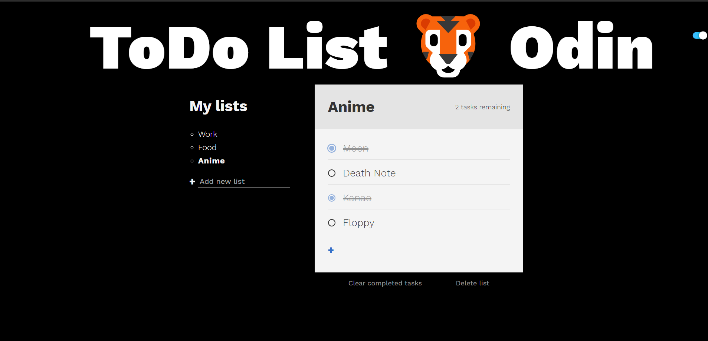

# Advance Todo-List 

#### Introduction 
Todo lists are a staple in beginning webdev tutorials because they can be very simple. There is, however, a lot of room for improvement and many features that can be added.



Checkout the site here - [Todo List](https://animeshry.github.io/ToDo-Odin/)

#### Clone Project -
```
git clone https://github.com/AnimeshRy/ToDo-Odin.git
cd ToDo-Odin
npm install
```

#### Recent Change - 
- Added Current Day to List Names.
  
#### Todo List for The Odin Project (TOP)

- [About TOP](https://www.theodinproject.com/about)

